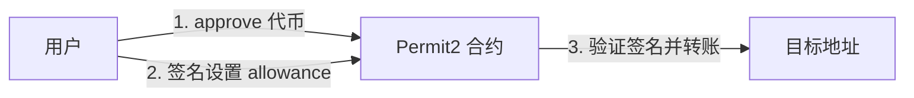

## 为什么需要 Permit？

### 传统 ERC20 授权的问题

在传统的 ERC20 代币转账中，如果第三方合约（如 DEX）要代表用户转移代币，需要两步操作：

1. **用户调用 `approve()`**: 授权第三方合约可以使用一定数量的代币（需要发送链上交易，消耗 gas）
2. **第三方调用 `transferFrom()`**: 实际执行代币转移（再次消耗 gas）

**存在的痛点**：
- **需要两笔交易**：用户体验差，操作繁琐
- **双倍 gas 费用**：用户需要支付两次交易费用
- **安全隐患**：无限授权（approve max uint256）存在安全风险，如果第三方合约被攻击，用户资金可能全部损失


### Permit 的解决方案

Permit 通过 **链下签名** 的方式实现授权，将两笔交易合并为一笔：

- 用户在链下签署一个授权消息（EIP-712 签名，不消耗 gas）
- 第三方合约在执行转账时，先验证签名并完成授权，再立即执行转账
- **只需一笔交易**，节省 gas 费用，提升用户体验


## Permit 的演进历史

### 1.1 最初：ERC20 标准

```
用户 → approve() → 第三方合约 → transferFrom() → 转账
```

缺点：两笔交易，双倍 gas

### 1.2 EIP-2612：原生 Permit 支持


EIP-2612 协议在 ERC20 基础上扩展，让每个代币合约原生支持 permit 方法；

Permit方法里会验证签名，根据参数修改token的allowance额度；

```solidity
// IERC20Permit.sol
interface IERC20Permit {
    // 每个地址的 Permit 签名计数器
    function nonces(address owner) external view returns (uint256);
    
    // 使用签名进行授权
    function permit(
        address owner,
        address spender,
        uint256 value,
        uint256 deadline,
        uint8 v,
        bytes32 r,
        bytes32 s
    ) external;
}
```

**优势**：一笔交易完成授权和转账  
**局限**：

- 每个代币合约都要单独实现 permit
- 老的 ERC20 代币无法升级支持
- 不同代币实现可能不一致

### 1.3 Permit2：统一的授权中间层


Uniswap 推出 Permit2 作为通用授权中间合约，解决了 EIP-2612 的局限性。

**核心思想**：用户将代币授权给 Permit2 合约（只需一次），

后续所有LP token的授权，都需要签名完成；

调用permit合约的permitTransferFrom方法，验证签名后，调用erc20 token的transferFrom即可。

支持批量转账

```
用户 → (一次性 approve) → Permit2 合约 → 多次通过签名授权不同应用
```


## 2、Permit vs Permit2：核心差异对比

| 对比维度 | Permit (EIP-2612) | Permit2 |
|---------|-------------------|---------|
| **实现方式** | 每个代币合约内置 permit 函数 | 独立的统一授权合约 |
| **兼容性** | 仅支持新发行且实现了 EIP-2612 的代币 | 支持所有 ERC20 代币（包括老代币） |
| **授权对象** | 每次授权特定的 spender | 只需一次授权给 Permit2，后续通过签名控制 |
| **授权管理** | 每个应用需要单独授权 | 统一在 Permit2 管理，支持细粒度控制 |
| **批量操作** | 不支持 | 支持批量授权和转账 |
| **架构** | 在 Token 合约内实现 | 两个独立合约：`AllowanceTransfer` 和 `SignatureTransfer` |
| **nonce 管理** | Token 合约内管理 | Permit2 统一管理，支持随机 nonce |
| **过期控制** | 单一 deadline | 支持授权过期时间和签名过期时间双重控制 |


## 3、Permit2 架构详解

Permit2 由两个独立合约组成：**SignatureTransfer** 和 **AllowanceTransfer**，分别适用于不同的业务场景。


### 3.1 Permit2 的两种模式

**SignatureTransfer（签名转账）**

- 用户通过签名直接授权一次性转账
- 适合单次交易场景（如 swap）
- 不需要链上 approve

**AllowanceTransfer（配额转账）**  

- 用户先 approve 给 Permit2，设置配额（allowance）
- 后续通过签名消费配额
- 适合需要多次交易的场景（如订单本交易）


### 3.2 SignatureTransfer（签名转账模式）

**工作流程：**


**核心原理：**  
用户预先将代币 approve 给 Permit2 合约，后续通过链下签名授权具体的转账操作。Permit2 验证签名后，直接从用户账户转账。

```
用户 → 链下签名授权 → Permit2 合约验证签名 → 执行转账
```

**适用场景**：一次性转账（如 DEX swap）


### 3.3 AllowanceTransfer（配额转账模式）

**工作流程：**



**核心原理：**  
用户首先 approve 代币给 Permit2，然后通过签名设置具体应用的配额（allowance）。应用可以在配额范围内多次转账。

```
用户 → approve 给 Permit2 → 签名设置配额 → 应用多次消费配额
```

**适用场景**：需要多次交易的场景（如订单簿、限价单）


## 流程测试

基于uniswap的permit2-sdk来进行测试

### Checkout the repo

- `git clone --recurse-submodules https://github.com/Uniswap/permit2-sdk.git`

### Install dependencies

- `yarn`

### Run Unit Tests

- `yarn test`   这里在干嘛？

命令如下：

```    
"test": "tsdx test --testPathIgnorePatterns=/permit2/"
```

实际上执行的测试用例如下：

```
$ tsdx test --testPathIgnorePatterns=/permit2/
 PASS  src/signatureTransfer.test.ts
 PASS  src/allowanceTransfer.test.ts
 PASS  src/constants.test.ts
```


### Run Forge tests

- `yarn build`
- `yarn interop`
- `(cd permit2 && forge build)`
- `forge test`  这里在干嘛？


## 6、参考文档

[permit2/overview](https://docs.uniswap.org/contracts/permit2/overview)


[useful-solidity-patterns/permit2](https://github.com/dragonfly-xyz/useful-solidity-patterns/tree/main/patterns/permit2)

